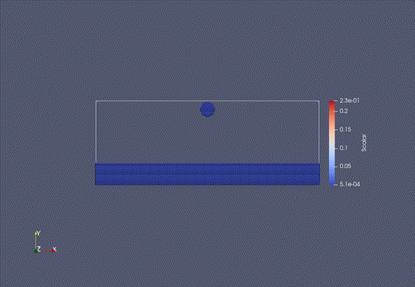
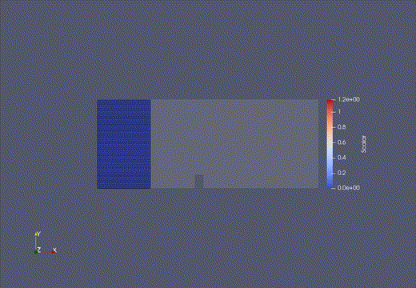
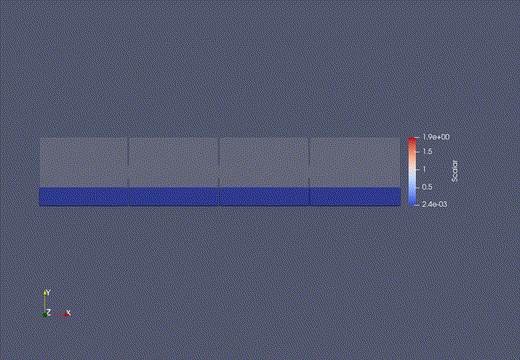

<div align="center">
  
</div>

Fluidchen is a CFD Solver developed for the CFD Lab taught at TUM Informatics, Chair of Scientific Computing in Computer Science. 

## Software Requirements

This code is known to work on all currently supported Ubuntu LTS versions (22.04, 20.04, 18.04).
In particular, you will need:

- A recent version of the GCC compiler. Other compilers should also work, but you may need to tweak the CMakeLists.txt file (contributions welcome). GCC 7.4, 9.3, and 11.2 are known to work. See `CMakeLists.txt` and `src/Case.cpp` for some compiler-specific code.
- CMake, to configure the build.
- The VTK library, to generate result files. libvtk7 and libvtk9 are known to work.
- OpenMPI (not for the skeleton, but when you implement parallelization).

Get the dependencies on Ubuntu:

```shell
sudo apt-get update
sudo apt-get upgrade
sudo apt-get install build-essential cmake libvtk7-qt-dev openmpi-bin libopenmpi-dev
```
## Input geometry

The geometry is fed to the solver in PGM format. Following are the tags to be used for defining the cell type,
Tag   Type 
0     Fluid
1     Inflow
2     Outflow
3     Wall (hot)
4     Wall (cold)
5     Wall (adiabatic)
6     Free-Slip
7     Empty

# Input data

The input data is fed to the solver in a .dat file by the user. In addition to the regular parameters, we also include the Particles per cell, as ppc, and Reynolds Number of the flow, as Re.

## Building the code

```shell
git clone https://github.com/gaurav44/CFD-lab.git
cd CFD-lab
mkdir build && cd build
cmake ..
make
```

After `make` completes successfully, you will get an executable `fluidchen` in your `build` directory. Run the code from this directory.
Note: Earlier versions of this documentation pointed to the option of `make install`. You may want to avoid this and directly work inside the repository while you develop the code.

### Build options

By default, **fluidchen** is installed in `DEBUG` mode. To obtain full performance, you can execute cmake as

```shell
cmake -DCMAKE_BUILD_TYPE=RELEASE ..
```

or

```shell
cmake -DCMAKE_CXX_FLAGS="-O3" ..
```

You can see and modify all CMake options with, e.g., `ccmake .` inside `build/` (Ubuntu package `cmake-curses-gui`).

A good idea would be that you setup your computers as runners for [GitLab CI](https://docs.gitlab.com/ee/ci/)
(see the file `.gitlab-ci.yml` here) to check the code building automatically every time you push.

## Running

In order to run **Fluidchen**, the case file should be given as input parameter. Some default case files are located in the `example_cases` directory. Navigate to the `build/` directory and run:

```shell
./fluidchen ../example_cases/LidDrivenCavity/LidDrivenCavity.dat
```

This will run the case file and create the output folder `../example_cases/LidDrivenCavity/LidDrivenCavity_Output`, which holds the `.vtk` files of the solution. 

If the input file does not contain a geometry file (added later in the course), fluidchen will run the lid-driven cavity case with the given parameters.

## Output

In the terminal window, we also output, `Timestep`, `Time`,`Residual`, and `Pressure Poisson Interpretation`. Until convergence, we also output error message. In case of Free surface flow, two files are generated for visualization `.vtk` and a `.vtp`, this will be read by Particle Reader in **Paraview**.

### Sample Outputs
<div align="center">
  
</div>

<div align="center">
  
</div>

